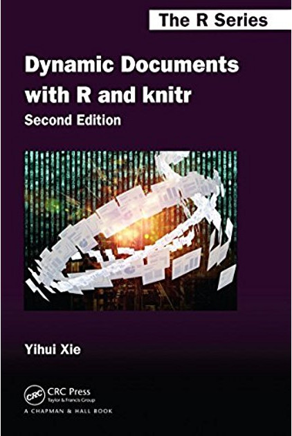
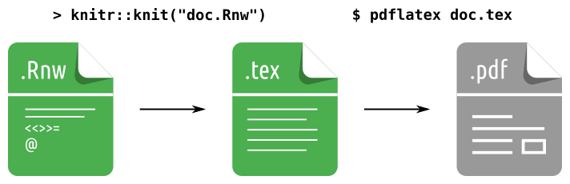

```{r include=FALSE}

library(knitr)
opts_chunk$set(
    warning = FALSE,
    message = FALSE,
    echo = FALSE,
    fig.align = "center")

```

# Disponibilização #

##  ##

- Repositório no GitHub <https://github.com/JrEduardo/semanest-ufpr2017>
- Slides no sítio do LEG <http://www.leg.ufpr.br/~eduardojr/semanest-ufpr2017>

## Referências ##

<style>
.myref {
    width: 33%;
    float: left;
    text-align: center;
    margin-top: 10px;
}
</style>

<div class="myref">
  <a href="https://github.com/christophergandrud/Rep-Res-Book" target="_blank">
    
  </a>
</div>

<div class="myref">
<!-- <div class="myref" style="padding-top: 30px;"> -->
  <a href="https://github.com/yihui/knitr-book" target="_blank">
    
  </a>
</div>

<div class="myref">
<!-- <div class="myref" style="padding-top: 60px;"> -->
  <a href="https://github.com/rstudio/bookdown" target="_blank">
    
  </a>
</div>

# Documentos dinâmicos? #

## Fluxo de trabalho ##

> **Dinâmico:** aquele que se modifica continuamente, que evolui; que
> pressupõe movimento, mudança.

```{r, echo=FALSE, out.width="100%"}


```

## Baseado em uma história real ##

Josefino e sua experiência no mercado de trabalho.

```{r, echo=FALSE, out.width="100%"}

knitr::include_graphics("images/small-modification.png")

```

# Documentos dinâmicos em R #

## Conceito bastante antigo ##

* _tangle_ (documentos para humanos)
* _weave_ (documentos para máquinas)
* `Sweave` (em 2002 por Friedrich Leisch)
* [Yhui Xie](http://yihui.name/)
    - `knitr`;
    - `rmarkdown`;
    - ...

## Família `down` (e agregados) ##

```{r, echo=FALSE, out.width="100%"}

knitr::include_graphics("images/rpackages.png")

```

## Família `down` (e agregados) ##

```{r, echo=FALSE, out.width="100%"}

knitr::include_graphics("images/rpackages2.png")

```

# Knitr #

##  ##

```{r, echo=FALSE, out.width="100%"}



```

##  ##

### Vantagens ###

> - Controle sobre toda a estrutura do documento;
> - A escrita é em LaTeX, portanto têm a flexibilidade do LaTeX;
> - As customizações (ambientes de código, ambientes para duas colunas,
>   etc.) são imediatas;

### Desvantagens ###

> - A escrita é em LaTeX, portanto deve-se saber a marcação LaTeX;
> - Somente arquivos em `.pdf` são gerados;

# Rmarkdown #

##  ##

```{r, echo=FALSE, out.width="100%"}

knitr::include_graphics("images/rmarkdown1.png")

```

##  ##

```{r, echo=FALSE, out.width="100%"}

knitr::include_graphics("images/rmarkdown2.png")

```

##  ##


## As opções YAML ##

 - Contemplam as opções interpretadas pelo `knitr` como as interpretadas
   pelo `pandoc`;
 - As interpretadas pelo `knitr` referem-se as passadas ao argumento
   `output`;
 - As demais opções são interpretadas diretamente pelo `pandoc`;

## ##

O YAML de `doc.Rmd` sendo:

```
---
output:
  html_document:
    toc: true
    theme: "united"
    fig_height: 6
---
```

é interpretado pelo `knitr` como:

```
rmarkdown::render(input = doc.Rmd',
                  output_format = html_document(
                      toc = TRUE,
                      theme = "united",
                      fig_height = 6))
```

## Os formatos internos ##

 - md_document
 - pdf_document
 - html_document
 - github_document
 - beamer_presentation
 - ioslides_presentation
 - odt_document
 - rtf_document
 - slidy_presentation
 - word_document

## Formatos por pacotes externos ##

- [tufte](https://github.com/rstudio/tufte): Estilo de "folheto"
  proposto por Edward Tufte (`.html` e `.pdf`);
- [rticles](https://github.com/rstudio/rticles): Formatos específicos
  para artigos (`.pdf`);
- [prettydoc](https://github.com/yixuan/prettydoc): Formatos para
  páginas web (`.html`);
- [rmdformats](https://github.com/juba/rmdformats): Formatos para
  páginas web (`.html`);
- [rmdshower](https://github.com/mangothecat/rmdshower): Apresentações
  usando `shower` (`.html`);
- [xaringan](https://github.com/yihui/xaringan): Apresentações usando
  `remark.js` (`.html`);
- [revealjs](https://github.com/rstudio/revealjs): Apresentações usando
  `reveal.js` (`.html`);
- [bookdown](https://github.com/rstudio/bookdown): Múltiplos arquivos
  para elaboração de documentos longos;
- [blogdown](https://github.com/rstudio/blogdown): Múltiplos arquivos
  para elaboração de sites e blogs;
- [pkgdown](https://github.com/hadley/pkgdown): Construção de páginas
  web para exposição de pacotes R;

##  ##

### Vantagens ###

> - A escrita é em Markdown, portanto é muito simples;
> - Portabilidade, um documento é capaz de gerar diversos formatos;
> - A manutenção é fácil devido à simplicidade.

### Desvantagens ###

> - A escrita é em Markdown, portanto têm a limitação do Markdown;
> - As "grandes" customizações não são imediatas, deve-se editar
>   templates ou incluir arquivos. 

# Blogdown #

##  ##

- Permite construir de forma muito simples blogs e sites;
- Utiliza o construtor de sites estáticos [Hugo](https://gohugo.io/). 

## Criando um site/blog ##

1. Instale o `blogdown`;
2. Instale o gerador `hugo`;
3. Escolha um tema <http://themes.gohugo.io/> (isso pode demorar muito!);
4. Edite suas páginas;
5. Tenha um servidor para disponibilização*

## A estrutura de um site com `blogdown` ##

```

.
└── meusite
    ├── config.[yaml, toml]
    ├── content
    ├── layouts
    ├── public
    └── themes
```

## Exemplos ##

- https://jreduardo.github.io/
- http://curso-r.com/
- https://yihui.name/


# Git e GitHub #

## Sistema de versionamento Git ##

```{r, echo=FALSE, eval=TRUE, out.width = "50%"}

knitr::include_graphics("images/thesis-funny.gif")

```

## Serviço de hospedagem e ambiente colaborativo GitHub ##

```{r, echo=FALSE, eval=TRUE, out.width = "85%"}

knitr::include_graphics("images/github.png")

```

## Por que Git/GitHub são importantes ? ##

- Atualmente a maioria dos pacotes em R são desenvolvidos sob
  versionamento Git e hospedados no GitHub;
- Pode-se ser acesso não só ao código-fonte, como também à trajetória de
  desenvolvimento (novas características, correções de _bugs_, melhoria
  de desempenho, etc.);
- Problemas com o pacote podem ser relatados nas _issues_, inclusive o
  seu problema já pode ter sido indicado por outras pessoas;
- Caso queria você pode facilmente _clonar_ o repositório de um pacote e
  modificá-lo como quiser. 

## Por que GitHub? ##

- É o sistema mais usado para armazenamento e desenvolvimento
  colaborativo deprojetos versionados com Git;
- A interface permite acompanhar projetos;
- Não tem limitação de repositórios abertos (para os privados deve-se
  adquirir um plano);
- Lhe concede um espaço no servidor para criar páginas web de seus
  projetos (agora já temos onde hospedar nosso site).

# Coisas a se estudar #

##  ##

- Integração contínua com GitHub ([travis.ci](https://travis-ci.org/))
- Aplicativos com [Shiny](http://shiny.rstudio.com/)
- Documentos com [flexdashboard](http://rmarkdown.rstudio.com/flexdashboard/)

# Obrigado #
